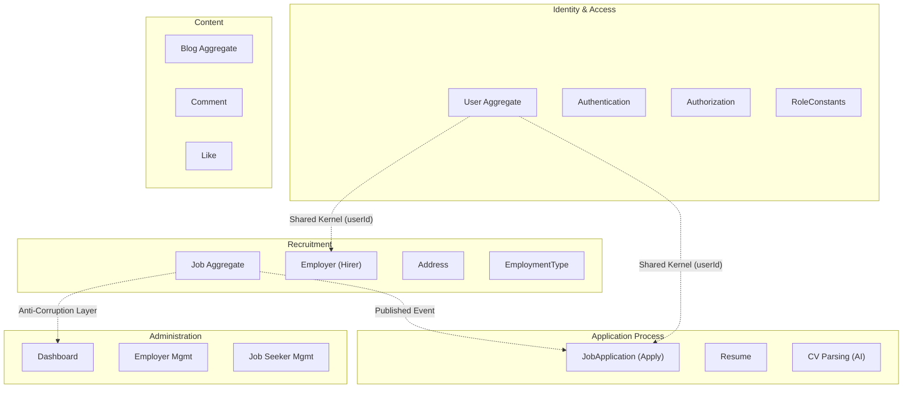
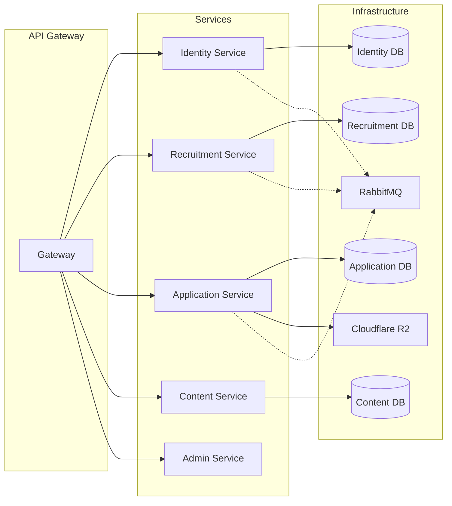

# 🔍 Phân Tích Codebase Theo Domain-Driven Design (DDD)

> **Cập nhật lần cuối**: 2026-05-05  
> **Mục tiêu dài hạn**: Refactor monolith → Microservices

---

## 1. Tổng Quan Kiến Trúc Hiện Tại

### Cấu trúc package hiện tại

```
com.nlu/
├── config/          # Cross-cutting configs
├── constant/        # EmploymentType enum, RoleConstants, ApiConstants
├── controller/      # Tổ chức theo feature (account, job, application, blog, admin...)
├── custom/          # Custom validators
├── data/            # Repositories + queryDSL/ + specification/
├── dto/             # Tổ chức theo feature (auth, job, application, blog, admin, common...)
├── exception/       # Exception hierarchy (AppException → BadRequest/NotFound/Forbidden/Unauthorized)
├── mapper/          # ✅ MỚI — JobMapper, BlogMapper, UserMapper, JobViewMapper, RegistrationFormMapper
├── message/         # RabbitMQ producer/consumer
├── models/          # Entities + vo/ (Value Objects)
│   └── vo/          # ✅ MỚI — EmailAddress, Password, PhoneNumber, ExperienceYears, DateRange, SocialLink
├── security/        # Filters (JWT, RateLimit, Logging)
├── seeder/          # Data seeder
├── service/         # Tổ chức theo feature + interface/impl pattern
├── shared/          # ✅ MỚI — (đã tạo, chưa có nội dung)
└── utils/           # ✅ ĐÃ SỬA — Đổi từ "utills" → "utils"
```

### Đánh giá tổng hợp — Trước vs Sau refactoring

| Tiêu chí DDD | Trước | Sau | Điểm hiện tại |
|---|---|---|---|
| Bounded Context rõ ràng | ❌ Không có ranh giới | ❌ Chưa tách package | 2/10 |
| Aggregate Root được định nghĩa | ❌ Không rõ ràng | ⚠️ Guard clauses trong setter | 3/10 |
| Rich Domain Model | ❌ Anemic Model | ✅ Entity có validation + behavior | **6/10** |
| Value Objects | ❌ Không có | ✅ 6 VOs đã tạo | **7/10** |
| Domain Events | ❌ Không có | ❌ Chưa triển khai | 1/10 |
| Ubiquitous Language | ⚠️ Một phần | ⚠️ EmploymentType enum ✅, nhưng `Apply`/`Hirer` chưa đổi tên | 5/10 |
| Repository Pattern đúng DDD | ⚠️ Một phần | ⚠️ + Specification pattern mới | 5/10 |
| Anti-Corruption Layer | ❌ Không có | ❌ Chưa có | 1/10 |
| Tách Application Service vs Domain Service | ❌ Không tách | ⚠️ JobQueryService tách read, nhưng chưa có Domain Service | 4/10 |
| Exception Hierarchy | ❌ Chung chung | ✅ AppException → BadRequest/NotFound/Forbidden/Unauthorized | **7/10** |
| Mapper Layer | ❌ Logic trong DTO | ✅ 5 Mappers riêng biệt | **8/10** |
| Date/Time chuẩn hóa | ❌ 3 kiểu khác nhau | ⚠️ Phần lớn → LocalDateTime, còn sót import thừa | **6/10** |

> [!IMPORTANT]
> **Kết luận**: Codebase đã có **tiến bộ đáng kể** từ Layered Architecture thuần túy sang hướng DDD. Điểm trung bình tăng từ **~2.4/10 → ~4.6/10**. Rich Domain Model và Value Objects là hai cải tiến nổi bật nhất. Tuy nhiên, vẫn chưa có Bounded Context boundaries — yếu tố **then chốt** để tiến sang microservices.

---

## 2. Chi Tiết Những Gì Đã Hoàn Thành ✅

### 2.1. Value Objects — 6 VOs đã tạo (`models/vo/`)

| Value Object | Dùng trong Entity | Validation tự chứa |
|---|---|---|
| `EmailAddress` | `User.email`, `Candidate.email` | Regex pattern, not-null |
| `Password` | `User.password` | Min 8 chars, not-null, `toString()` trả `[PROTECTED]` |
| `PhoneNumber` | `User.mobile`, `Candidate.phoneNumber` | Regex `^\d{10,11}$`, not-null |
| `ExperienceYears` | `Job.yearOfExperience` | Không âm |
| `DateRange` | *(chưa embed trong entity nào)* | start < end, `isExpired()` method |
| `SocialLink` | `Hirer.socialLink` | URL format, HTTPS only |

> [!TIP]
> **Điểm tốt**: Tất cả VOs đều là `@Embeddable`, immutable qua constructor validation, có `protected` no-arg constructor cho JPA, và `@EqualsAndHashCode` cho value equality.

### 2.2. Rich Domain Model — Entity có validation & behavior

**Job.java** — Từ data holder → entity có guard clauses:
```java
// ✅ Mỗi setter validate input trước khi gán
public void setTitle(String title) {
    if (title == null || title.trim().isEmpty()) {
        throw new BadRequestException(MessageUtils.getMessage("validation.job.name.required"));
    }
    this.title = title;
}

// ✅ EmploymentType enum thay vì String
@Enumerated(EnumType.STRING)
private EmploymentType time;

// ✅ ExperienceYears Value Object thay vì int
@Embedded
private ExperienceYears yearOfExperience;
```

**Các entity đã có guard clauses**: `Job`, `User`, `Blog`, `Hirer`, `Candidate`, `Apply`, `Resume`, `Comment`, `Like`

### 2.3. Mapper Layer — Tách logic khỏi DTO

| Mapper | Chức năng |
|---|---|
| `JobMapper` | `toJob(DTO)`, `updateJob(DTO, Job)` |
| `BlogMapper` | `toBlog(DTO)`, `applyTo(DTO, Blog)` |
| `UserMapper` | `toUserInfo(User)`, `updateUser(UserInfo, User)` |
| `JobViewMapper` | `toJobCardView(Job)`, `toJobDetailView(Job)`, `toHirerJobPostView(JobResponse)` |
| `RegistrationFormMapper` | `toUser(form, encoder, role)` — Dùng VOs `Password`, `EmailAddress` |

> **JobDTO** không còn chứa `toJob()`/`updateJob()` — đã chuyển thành `record` thuần túy.

### 2.4. EmploymentType Enum

```java
public enum EmploymentType {
    Full_time, Part_time, Remote, Hybrid;
}
```
Đã dùng trong: `Job.time`, `JobDTO.jobType`, `JobCardView`, `JobQueryService`, `JobFilterDTO`

### 2.5. Exception Hierarchy

```
AppException (abstract base, chứa HttpStatus)
├── BadRequestException    (400) — Domain validation errors
├── ResourceNotFoundException (404) — Entity not found
├── ForbiddenException     (403) — Authorization failures
└── UnauthorizedException  (401) — Authentication failures
```

`GlobalExceptionHandler` xử lý tập trung, trả `ApiResponse` + `traceId` — Controller/Service không cần biết HTTP.

### 2.6. Service Refactoring

- **`ApplyService`**: Không còn trả `ApiResponse<String>` → trả `void`, throw exception khi lỗi ✅
- **`JobService`**: Trả `void` / `JobDetailView` / `JobCardView` — không có HTTP concern ✅
- **`ResumeService`**: Trả domain objects (`ResumeView`, `ResumeDetailDTO`) ✅
- **`AuthService`**: Trả `String` (token/message) ✅
- **`JobQueryService`**: Tách riêng read operations — hướng CQRS Lite ✅

### 2.7. Fixes nhỏ

- ✅ `utills` → `utils` (fix typo)
- ✅ `@Data` removed → `@Getter` + custom setters (hầu hết entities)
- ✅ `Specification` pattern thêm (`data/specification/JobSpecifications`)
- ✅ `RoleConstants` — centralize role logic, `normalizeRole()`, `isValidRole()`

---

## 3. Những Vấn Đề Còn Tồn Tại

### 3.1. Bounded Context chưa được tách (Nghiêm trọng nhất cho microservices)

Tất cả code vẫn nằm **flat** trong `com.nlu.*`. Không có ranh giới module nào. Đây là **blocker #1** cho microservice migration.

### 3.2. Naming chưa theo Ubiquitous Language

| Hiện tại | Vấn đề | Đề xuất |
|---|---|---|
| `Apply` | Tên động từ cho entity | `JobApplication` |
| `Hirer` | Không đúng thuật ngữ ngành | `Employer` hoặc `Recruiter` |
| `time` trong Job | Mơ hồ — trường chứa EmploymentType | `employmentType` |
| `keyCf` trong Resume | Không rõ nghĩa | `storageKey` |
| `yoe` trong Resume | Viết tắt | `yearsOfExperience` |

### 3.3. EmploymentType naming convention

```java
// ❌ Hiện tại: dùng Mixed_case — vi phạm Java enum convention
Full_time, Part_time, Remote, Hybrid

// ✅ Nên: UPPER_SNAKE_CASE
FULL_TIME, PART_TIME, REMOTE, HYBRID
```

### 3.4. ApplyServiceImpl vẫn truy cập 4 repositories

```java
private final ApplyRepository applyRepository;
private final ResumeRepository resumeRepository;
private final JobRepository jobRepository;
private final UserRepository userRepository;
```

### 3.5. Domain Events chưa có

`ApplyServiceImpl` vẫn gọi `messageProducer` trực tiếp — coupling chặt:
```java
messageProducer.uploadToCloud(new CloudUploadMessage(...));
messageProducer.processAI(new ResumeParsingMessage(...));
```

### 3.6. BlogServiceImpl — BlogMapper chưa inject đúng (Đã giải quyết ✅)

```java
// ✅ Đã thêm final và inject qua constructor
private final BlogMapper blogMapper;
```

### 3.7. Một số entity dùng NullPointerException thay vì domain exception (Đã giải quyết ✅)

```java
// ✅ Đã thay thế bằng BadRequestException trong Apply.java, Resume.java, v.v.
throw new com.nlu.exception.BadRequestException("user is null"); 
```

### 3.8. `shared/` package rỗng (Đã giải quyết ✅)

Đã di chuyển `StatusEntity`, `EntityStatus`, `ApiResponse`, `PageResponse` vào package `shared/`.

### 3.9. Import thừa

- `ApiResponse` import thừa trong: `ApplyServiceImpl`, `BlogService`
- `java.sql.Timestamp` import thừa trong: `Comment`, `Candidate`
- `java.time.Instant` import thừa trong: `Job`, `Hirer`, `Blog`

---

## 4. Bounded Contexts Đề Xuất (Cho Microservice Migration)



---

## 5. Lộ Trình 3 Giai Đoạn → Microservices

### Giai Đoạn 1: Hoàn Thiện DDD Trong Monolith (Quick Wins)

#### 1A. Fix tức thì (< 1 ngày)

- [x] Fix `BlogServiceImpl`: inject `BlogMapper` qua constructor (`final` + `@RequiredArgsConstructor`)
- [x] Thay `NullPointerException` → `BadRequestException` trong `Apply`, `Resume`, `Comment`, `Like`, `Hirer`, `Blog`
- [x] Xóa import thừa (`ApiResponse`, `Timestamp`, `Instant`)
- [x] Fix `EmploymentType` enum naming: `Full_time` → `FULL_TIME`, etc.

#### 1B. Cải thiện domain model (1-3 ngày)

- [x] Di chuyển `StatusEntity`, `EntityStatus` → `shared/`
- [x] Di chuyển `ApiResponse`, `PageResponse` → `shared/`
- [ ] Sử dụng `DateRange` VO ở nơi phù hợp (ví dụ: Job posting period)
- [ ] Thêm `ExperienceYears` VO cho `Resume.yoe`
- [x] Thêm domain methods (`Job.isExpired()`, `Job.isOwnedBy(Hirer)`)
- [ ] Tạo domain method `JobApplication.submit(Job, Resume, User)` — factory method

#### 1C. Rename theo Ubiquitous Language (cần coordinate với frontend)

- [x] `Apply` → `JobApplication`
- [x] `Hirer` → `Employer` (Hiện đang dùng `Recruiment`)
- [ ] `Job.time` → `Job.employmentType`
- [ ] `Resume.keyCf` → `Resume.storageKey`
- [ ] `Resume.yoe` → `Resume.yearsOfExperience`

---

### Giai Đoạn 2: Tách Module Theo Bounded Context (Modular Monolith)

> **Đây là bước quan trọng nhất** — tách module trong monolith an toàn hơn nhiều so với nhảy thẳng sang microservices.

```
com.nlu/
├── identity/                          # BC: Identity & Access
│   ├── domain/
│   │   ├── model/                     # User, Role
│   │   ├── vo/                        # EmailAddress, Password, PhoneNumber
│   │   └── repository/               # UserRepository
│   ├── application/                   # AuthService, AccountService
│   ├── infrastructure/                # JWT, OAuth2, Security filters
│   └── api/                           # AuthController, AccountController
│
├── recruitment/                       # BC: Recruitment
│   ├── domain/
│   │   ├── model/                     # Job, Employer, Address
│   │   ├── vo/                        # ExperienceYears, EmploymentType
│   │   ├── repository/               # JobRepository, EmployerRepository
│   │   ├── event/                     # JobPublishedEvent, JobExpiredEvent
│   │   └── service/                   # JobDomainService
│   ├── application/                   # JobAppService, JobQueryService
│   ├── infrastructure/                # QueryDSL, Specification
│   ├── mapper/                        # JobMapper, JobViewMapper
│   └── api/                           # HirerJobController, PublicJobController
│
├── application_process/               # BC: Application Process
│   ├── domain/
│   │   ├── model/                     # JobApplication, Resume
│   │   ├── event/                     # ApplicationSubmittedEvent
│   │   ├── repository/               # ApplicationRepository, ResumeRepository
│   │   └── service/                   # ApplicationDomainService
│   ├── application/                   # ApplyAppService, ResumeAppService
│   ├── infrastructure/                # Cloud storage, AI parsing, FileService
│   └── api/                           # UserApplicationController
│
├── content/                           # BC: Content
│   ├── domain/model/                  # Blog, Comment, Like
│   ├── application/                   # BlogService
│   ├── mapper/                        # BlogMapper
│   └── api/                           # BlogController
│
├── admin/                             # BC: Administration
│   ├── application/
│   └── api/
│
└── shared/                            # Shared Kernel
    ├── domain/                        # StatusEntity, EntityStatus
    ├── infrastructure/                # RabbitMQ, Redis, R2 configs
    └── api/                           # ApiResponse, PageResponse, GlobalExceptionHandler
```

**Quy tắc khi tách module:**
1. Mỗi BC chỉ truy cập entity của mình qua repository riêng
2. Cross-BC communication qua **domain events** hoặc **ID reference** (không dùng JPA relationship cross-BC)
3. Shared Kernel chứa base classes dùng chung (StatusEntity, ApiResponse)

---

### Giai Đoạn 3: Domain Events + CQRS Lite → Microservice Split

#### 3A. Domain Events thay thế gọi trực tiếp

```java
// Domain Event
public record ApplicationSubmittedEvent(
    long applicationId, long jobId, long resumeId, long userId
) {}

// Trong JobApplication aggregate — factory method
public class JobApplication extends StatusEntity {
    public static JobApplication submit(Job job, Resume resume, User user) {
        var app = new JobApplication();
        app.setJob(job);
        app.setResume(resume);
        app.setUser(user);
        app.registerEvent(new ApplicationSubmittedEvent(...));
        return app;
    }
}

// Event handler (thay thế gọi trực tiếp MessageProducer)
@Component
public class ApplicationEventHandler {
    @TransactionalEventListener
    public void onSubmitted(ApplicationSubmittedEvent event) {
        messageProducer.processAI(...);
        messageProducer.uploadToCloud(...);
    }
}
```

#### 3B. CQRS Lite — Tách Read/Write rõ ràng hơn

```
recruitment/
├── command/        # Write: CreateJobCommand, UpdateJobCommand
│   └── handler/    # CommandHandler implementations
└── query/          # Read: JobQueryService (existing), JobQuery (QueryDSL)
    └── view/       # Read-optimized DTOs: JobCardView, JobDetailView
```

#### 3C. Microservice Split

Khi modular monolith ổn định, tách từng BC thành service riêng:



**Thứ tự split đề xuất:**
1. **Content Service** — Ít coupling nhất, dễ tách
2. **Identity Service** — Dùng chung bởi tất cả, tách sớm để các service khác gọi qua API
3. **Recruitment Service** — Core business
4. **Application Service** — Phụ thuộc Recruitment + Identity
5. **Admin Service** — Aggregation layer, tách cuối

---

## 6. Bảng Tổng Hợp Ưu Tiên Hành Động

| # | Hành động | Trạng thái | Mức độ khó | Ưu tiên |
|---|---|---|---|---|
| 1 | Fix typo `utills` → `utils` | ✅ Đã xong | 🟢 | — |
| 2 | Tạo `EmploymentType` enum | ✅ Đã xong | 🟢 | — |
| 3 | Tạo Value Objects (Email, Password, Phone, ExperienceYears, DateRange, SocialLink) | ✅ Đã xong | 🟡 | — |
| 4 | Di chuyển `toJob()`/`updateJob()` khỏi DTO → Mapper layer | ✅ Đã xong | 🟢 | — |
| 5 | Thêm guard clauses (domain validation) vào entities | ✅ Đã xong | 🟡 | — |
| 6 | Tạo exception hierarchy (AppException → subtypes) | ✅ Đã xong | 🟡 | — |
| 7 | Service không trả `ApiResponse` — trả domain object/exception | ✅ Đã xong (phần lớn) | 🟡 | — |
| 8 | Tách `JobQueryService` (CQRS Lite read side) | ✅ Đã xong | 🟡 | — |
| 9 | Fix `BlogServiceImpl` inject `BlogMapper` | ✅ Đã xong | 🟢 | — |
| 10 | Thay `NullPointerException` → `BadRequestException` | ✅ Đã xong | 🟢 | — |
| 11 | Fix `EmploymentType` naming → UPPER_SNAKE | ✅ Đã xong | 🟢 | — |
| 12 | Xóa import thừa (`ApiResponse`, `Timestamp`, `Instant`) | ✅ Đã xong | 🟢 | — |
| 13 | Thêm domain methods (`Job.isExpired()`, `Job.isOwnedBy()`) | ✅ Đã xong | 🟡 | — |
| 14 | Rename `Apply` → `JobApplication`, `Hirer` → `Employer` | ✅ Đã xong | 🟡 | — |
| 15 | Populate `shared/` package | ✅ Đã xong | 🟡 | — |
| 16 | Tái cấu trúc package theo Bounded Context (Modular Monolith) | ❌ Chưa làm | 🔴 | **P2** |
| 17 | Domain Events thay thế `MessageProducer` trực tiếp | ❌ Chưa làm | 🔴 | P3 |
| 18 | CQRS — Command/Query separation hoàn chỉnh | ❌ Chưa làm | 🔴 | P3 |
| 19 | Microservice split | ❌ Chưa làm | 🔴🔴 | P4 |

> [!TIP]
> **Khuyến nghị tiếp theo**: Hoàn thành items 9–13 (P0/P1) trước — đây là quick wins không phá cấu trúc. Sau đó ưu tiên item **16 (Modular Monolith)** vì đây là **bước bắt buộc** trước khi split microservices.

> [!WARNING]
> **Đừng nhảy thẳng sang microservices** mà bỏ qua Modular Monolith (Giai đoạn 2). Tách service mà không có bounded context rõ ràng sẽ tạo ra "distributed monolith" — tệ hơn monolith ban đầu.
